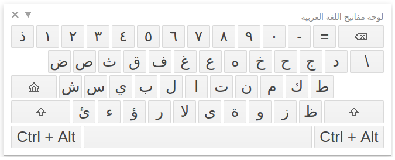
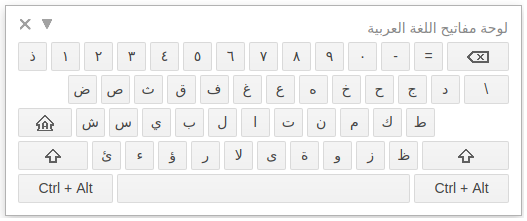

# Google Input Tools: large keyboard

*Large font size for Google Input Tools' keyboard.*

**With this Chrome extension :+1:**

Without :sob:

[Why this?](docs/why.md)

## How to get it?

* Install [Google Input Tools](https://chrome.google.com/webstore/detail/google-input-tools/mclkkofklkfljcocdinagocijmpgbhab).
* Install this Chrome extension.
